# MLA 智学引擎 — 数据库结构文档

> 数据库: PostgreSQL | ORM: SQLAlchemy 2.0 异步 | 主键: UUID v4

---

## 〇、建表 SQL

```sql
-- ==========================================
-- MLA 智学引擎 — 完整建表 DDL (PostgreSQL)
-- ==========================================

-- 启用 uuid-ossp 扩展 (UUID v4 生成)
CREATE EXTENSION IF NOT EXISTS "uuid-ossp";


-- ------------------------------------------
-- 1. users — 用户表
-- ------------------------------------------
CREATE TABLE users (
    id              UUID PRIMARY KEY DEFAULT uuid_generate_v4(),
    username        VARCHAR(50)  NOT NULL UNIQUE,
    email           VARCHAR(100) NOT NULL UNIQUE,
    password_hash   VARCHAR(255) NOT NULL,
    full_name       VARCHAR(50),
    school          VARCHAR(100),
    major           VARCHAR(100),
    grade           VARCHAR(20),
    education_level VARCHAR(20),
    role            VARCHAR(20)  NOT NULL DEFAULT 'student',
    avatar          VARCHAR(500),
    nickname        VARCHAR(50),
    email_verified  BOOLEAN      NOT NULL DEFAULT FALSE,
    created_at      TIMESTAMPTZ  NOT NULL DEFAULT NOW(),
    updated_at      TIMESTAMPTZ  NOT NULL DEFAULT NOW()
);
CREATE INDEX idx_users_username ON users (username);
CREATE INDEX idx_users_email    ON users (email);


-- ------------------------------------------
-- 2. courses — 课程表
-- ------------------------------------------
CREATE TABLE courses (
    id          UUID PRIMARY KEY DEFAULT uuid_generate_v4(),
    name        VARCHAR(200) NOT NULL,
    description TEXT,
    cover_image VARCHAR(500),
    created_by  UUID REFERENCES users(id) ON DELETE SET NULL,
    created_at  TIMESTAMPTZ  NOT NULL DEFAULT NOW(),
    updated_at  TIMESTAMPTZ  NOT NULL DEFAULT NOW()
);
CREATE INDEX idx_courses_name ON courses (name);


-- ------------------------------------------
-- 3. chapters — 章节表
-- ------------------------------------------
CREATE TABLE chapters (
    id          UUID PRIMARY KEY DEFAULT uuid_generate_v4(),
    course_id   UUID         NOT NULL REFERENCES courses(id) ON DELETE CASCADE,
    title       VARCHAR(200) NOT NULL,
    description TEXT,
    order_index INTEGER      NOT NULL DEFAULT 0,
    created_at  TIMESTAMPTZ  NOT NULL DEFAULT NOW()
);


-- ------------------------------------------
-- 4. knowledge_points — 知识点表
-- ------------------------------------------
CREATE TABLE knowledge_points (
    id                 UUID PRIMARY KEY DEFAULT uuid_generate_v4(),
    chapter_id         UUID         NOT NULL REFERENCES chapters(id) ON DELETE CASCADE,
    title              VARCHAR(200) NOT NULL,
    description        TEXT,
    content            TEXT,
    prerequisite_kp_id UUID REFERENCES knowledge_points(id) ON DELETE SET NULL,
    kp_type                      VARCHAR(20)  NOT NULL DEFAULT 'item',
    parent_kp_id                 UUID REFERENCES knowledge_points(id) ON DELETE SET NULL,
    difficulty                   VARCHAR(20)  NOT NULL DEFAULT 'medium',
    source_type                  VARCHAR(20)  NOT NULL DEFAULT 'manual',
    -- 快问AI: AI 解释字段 (用户手动触发浓缩后存储)
    ai_explanation               TEXT,
    ai_explanation_generated_at  TIMESTAMPTZ,
    ai_explanation_query         TEXT,
    ai_explanation_report_count  INTEGER      NOT NULL DEFAULT 0,
    ai_explanation_model         VARCHAR(50),
    created_at                   TIMESTAMPTZ  NOT NULL DEFAULT NOW()
);


-- ------------------------------------------
-- 5. documents — 文档表
-- ------------------------------------------
CREATE TABLE documents (
    id            UUID PRIMARY KEY DEFAULT uuid_generate_v4(),
    course_id     UUID         NOT NULL REFERENCES courses(id) ON DELETE CASCADE,
    chapter_id    UUID REFERENCES chapters(id) ON DELETE SET NULL,
    filename      VARCHAR(255) NOT NULL,
    file_type     VARCHAR(20)  NOT NULL,
    file_size     INTEGER      NOT NULL DEFAULT 0,
    file_path     VARCHAR(500) NOT NULL,
    parse_status  VARCHAR(20)  NOT NULL DEFAULT 'pending',
    chunk_count   INTEGER      NOT NULL DEFAULT 0,
    page_count    INTEGER      NOT NULL DEFAULT 0,
    kp_count      INTEGER      NOT NULL DEFAULT 0,
    error_message TEXT,
    created_at    TIMESTAMPTZ  NOT NULL DEFAULT NOW(),
    updated_at    TIMESTAMPTZ  NOT NULL DEFAULT NOW()
);


-- ------------------------------------------
-- 6. document_chunks — 文本切片表 (DOCX/MD/TXT)
-- ------------------------------------------
CREATE TABLE document_chunks (
    id                 UUID PRIMARY KEY DEFAULT uuid_generate_v4(),
    document_id        UUID    NOT NULL REFERENCES documents(id) ON DELETE CASCADE,
    knowledge_point_id UUID REFERENCES knowledge_points(id) ON DELETE SET NULL,
    chunk_index        INTEGER NOT NULL DEFAULT 0,
    content            TEXT    NOT NULL,
    chunk_metadata     JSONB   DEFAULT '{}'::jsonb,
    token_count        INTEGER NOT NULL DEFAULT 0,
    created_at         TIMESTAMPTZ NOT NULL DEFAULT NOW()
);


-- ------------------------------------------
-- 7. document_pages — 文档页面表 (PDF/PPTX)
-- ------------------------------------------
CREATE TABLE document_pages (
    id            UUID PRIMARY KEY DEFAULT uuid_generate_v4(),
    document_id   UUID         NOT NULL REFERENCES documents(id) ON DELETE CASCADE,
    page_number   INTEGER      NOT NULL,
    image_path    VARCHAR(500) NOT NULL,
    summary       TEXT,
    extracted_kps JSONB        DEFAULT '[]'::jsonb,
    created_at    TIMESTAMPTZ  NOT NULL DEFAULT NOW()
);


-- ------------------------------------------
-- 8. page_knowledge_points — 页面-知识点关联表
-- ------------------------------------------
CREATE TABLE page_knowledge_points (
    id                 UUID PRIMARY KEY DEFAULT uuid_generate_v4(),
    document_page_id   UUID    NOT NULL REFERENCES document_pages(id) ON DELETE CASCADE,
    knowledge_point_id UUID    NOT NULL REFERENCES knowledge_points(id) ON DELETE CASCADE,
    relevance          FLOAT   NOT NULL DEFAULT 1.0,
    created_at         TIMESTAMPTZ NOT NULL DEFAULT NOW(),
    CONSTRAINT uq_page_kp UNIQUE (document_page_id, knowledge_point_id)
);


-- ------------------------------------------
-- 9. conversations — 对话表
-- ------------------------------------------
CREATE TABLE conversations (
    id                      UUID PRIMARY KEY DEFAULT uuid_generate_v4(),
    user_id                 UUID        NOT NULL REFERENCES users(id) ON DELETE CASCADE,
    course_id               UUID REFERENCES courses(id) ON DELETE SET NULL,
    title                   VARCHAR(200) NOT NULL DEFAULT '新对话',
    conversation_type       VARCHAR(20)  NOT NULL DEFAULT 'chat',
    profile_collection_stage VARCHAR(50),
    created_at              TIMESTAMPTZ NOT NULL DEFAULT NOW(),
    updated_at              TIMESTAMPTZ NOT NULL DEFAULT NOW()
);


-- ------------------------------------------
-- 10. messages — 消息表
-- ------------------------------------------
CREATE TABLE messages (
    id              UUID PRIMARY KEY DEFAULT uuid_generate_v4(),
    conversation_id UUID        NOT NULL REFERENCES conversations(id) ON DELETE CASCADE,
    role            VARCHAR(20) NOT NULL,
    content         TEXT        NOT NULL,
    sources         JSONB,
    message_metadata JSONB,
    created_at      TIMESTAMPTZ NOT NULL DEFAULT NOW()
);


-- ------------------------------------------
-- 11. student_profiles — 学生画像表
-- ------------------------------------------
CREATE TABLE student_profiles (
    id                UUID PRIMARY KEY DEFAULT uuid_generate_v4(),
    user_id           UUID        NOT NULL UNIQUE REFERENCES users(id) ON DELETE CASCADE,
    profile_data      JSONB       NOT NULL DEFAULT '{}'::jsonb,
    confidence_scores JSONB       NOT NULL DEFAULT '{}'::jsonb,
    missing_fields    JSONB       NOT NULL DEFAULT '[]'::jsonb,
    summary           TEXT,
    memories          JSONB       NOT NULL DEFAULT '[]'::jsonb,
    version           INTEGER     NOT NULL DEFAULT 1,
    created_at        TIMESTAMPTZ NOT NULL DEFAULT NOW(),
    updated_at        TIMESTAMPTZ NOT NULL DEFAULT NOW()
);
CREATE INDEX idx_student_profiles_user_id ON student_profiles (user_id);


-- ------------------------------------------
-- 12. system_configs — 系统配置表
-- ------------------------------------------
CREATE TABLE system_configs (
    id           UUID PRIMARY KEY DEFAULT uuid_generate_v4(),
    config_key   VARCHAR(100) NOT NULL UNIQUE,
    config_value TEXT         NOT NULL DEFAULT '',
    updated_at   TIMESTAMPTZ  NOT NULL DEFAULT NOW()
);
CREATE INDEX idx_system_configs_key ON system_configs (config_key);


-- ------------------------------------------
-- 13. email_verifications — 邮箱验证码表
-- ------------------------------------------
CREATE TABLE email_verifications (
    id         UUID PRIMARY KEY DEFAULT uuid_generate_v4(),
    email      VARCHAR(100) NOT NULL,
    code       VARCHAR(6)   NOT NULL,
    purpose    VARCHAR(20)  NOT NULL,
    expires_at TIMESTAMPTZ  NOT NULL,
    used       BOOLEAN      NOT NULL DEFAULT FALSE,
    created_at TIMESTAMPTZ  NOT NULL DEFAULT NOW()
);
CREATE INDEX idx_email_verifications_email ON email_verifications (email);


-- ------------------------------------------
-- 14. audit_logs — 审计日志表
-- ------------------------------------------
CREATE TABLE audit_logs (
    id         UUID PRIMARY KEY DEFAULT uuid_generate_v4(),
    user_id    UUID,
    action     VARCHAR(50)  NOT NULL,
    ip_address VARCHAR(50),
    user_agent VARCHAR(500),
    details    JSONB        DEFAULT '{}'::jsonb,
    created_at TIMESTAMPTZ  NOT NULL DEFAULT NOW()
);
CREATE INDEX idx_audit_logs_user_id ON audit_logs (user_id);
CREATE INDEX idx_audit_logs_action  ON audit_logs (action);


-- ------------------------------------------
-- 15. learning_sessions — 学习会话表
-- ------------------------------------------
CREATE TABLE learning_sessions (
    id                  UUID PRIMARY KEY DEFAULT uuid_generate_v4(),
    user_id             UUID        NOT NULL REFERENCES users(id) ON DELETE CASCADE,
    course_id           UUID        NOT NULL REFERENCES courses(id) ON DELETE CASCADE,
    status              VARCHAR(20) NOT NULL DEFAULT 'active',
    learning_path       JSONB       NOT NULL DEFAULT '{}'::jsonb,
    current_stage_index INTEGER     NOT NULL DEFAULT 0,
    profile_snapshot    JSONB       NOT NULL DEFAULT '{}'::jsonb,
    session_metadata    JSONB       NOT NULL DEFAULT '{}'::jsonb,
    is_favorited        BOOLEAN     NOT NULL DEFAULT FALSE,
    created_at          TIMESTAMPTZ NOT NULL DEFAULT NOW(),
    updated_at          TIMESTAMPTZ NOT NULL DEFAULT NOW()
);
CREATE INDEX idx_learning_sessions_user_id ON learning_sessions (user_id);
CREATE INDEX idx_learning_sessions_course_id ON learning_sessions (course_id);


-- ------------------------------------------
-- 16. learning_stages — 学习阶段表
-- ------------------------------------------
CREATE TABLE learning_stages (
    id                  UUID PRIMARY KEY DEFAULT uuid_generate_v4(),
    session_id          UUID         NOT NULL REFERENCES learning_sessions(id) ON DELETE CASCADE,
    title               VARCHAR(200) NOT NULL,
    description         TEXT,
    order_index         INTEGER      NOT NULL DEFAULT 0,
    status              VARCHAR(20)  NOT NULL DEFAULT 'pending',
    knowledge_point_ids JSONB        NOT NULL DEFAULT '[]'::jsonb,
    stage_metadata      JSONB        NOT NULL DEFAULT '{}'::jsonb,
    created_at          TIMESTAMPTZ  NOT NULL DEFAULT NOW(),
    updated_at          TIMESTAMPTZ  NOT NULL DEFAULT NOW(),
    CONSTRAINT uq_learning_stage_session_order UNIQUE (session_id, order_index)
);
CREATE INDEX idx_learning_stages_session_id ON learning_stages (session_id);


-- ------------------------------------------
-- 17. generated_resources — 生成资源表
-- ------------------------------------------
CREATE TABLE generated_resources (
    id                UUID PRIMARY KEY DEFAULT uuid_generate_v4(),
    stage_id          UUID        NOT NULL REFERENCES learning_stages(id) ON DELETE CASCADE,
    resource_type     VARCHAR(30) NOT NULL,
    title             VARCHAR(300) NOT NULL,
    description       TEXT,
    content           TEXT        NOT NULL DEFAULT '',
    resource_metadata JSONB       NOT NULL DEFAULT '{}'::jsonb,
    order_index       INTEGER     NOT NULL DEFAULT 0,
    created_at        TIMESTAMPTZ NOT NULL DEFAULT NOW()
);
CREATE INDEX idx_generated_resources_stage_id ON generated_resources (stage_id);


-- ------------------------------------------
-- 18. agent_tasks — 智能体任务追踪表
-- ------------------------------------------
CREATE TABLE agent_tasks (
    id             UUID PRIMARY KEY DEFAULT uuid_generate_v4(),
    session_id     UUID        NOT NULL REFERENCES learning_sessions(id) ON DELETE CASCADE,
    resource_id    UUID REFERENCES generated_resources(id) ON DELETE SET NULL,
    agent_name     VARCHAR(30) NOT NULL,
    status         VARCHAR(20) NOT NULL DEFAULT 'pending',
    input_summary  TEXT,
    output_summary TEXT,
    latency_ms     INTEGER,
    token_count    INTEGER,
    error_message  TEXT,
    created_at     TIMESTAMPTZ NOT NULL DEFAULT NOW(),
    completed_at   TIMESTAMPTZ
);
CREATE INDEX idx_agent_tasks_session_id ON agent_tasks (session_id);
```

---

## 一、总览 (UML 类图)

```mermaid
classDiagram
    direction TB

    User "1" -- "n" Course : created_by
    User "1" -- "n" Conversation : user_id
    User "1" -- "1" StudentProfile : user_id
    User "1" -- "n" AuditLog : user_id
    User "1" -- "n" LearningSession : user_id

    Course "1" -- "n" Chapter : course_id
    Course "1" -- "n" Document : course_id
    Course "1" -- "n" LearningSession : course_id

    Chapter "1" -- "n" KnowledgePoint : chapter_id
    Chapter "1" -- "n" Document : chapter_id

    KnowledgePoint "1" -- "n" KnowledgePoint : prerequisite_kp_id
    KnowledgePoint "n" -- "n" DocumentPage : page_knowledge_points

    Document "1" -- "n" DocumentChunk : document_id
    Document "1" -- "n" DocumentPage : document_id

    DocumentChunk "n" -- "1" KnowledgePoint : knowledge_point_id

    Conversation "1" -- "n" Message : conversation_id
    Conversation "n" -- "1" Course : course_id

    LearningSession "1" -- "n" LearningStage : session_id
    LearningSession "1" -- "n" AgentTask : session_id

    LearningStage "1" -- "n" GeneratedResource : stage_id

    GeneratedResource "1" -- "n" AgentTask : resource_id
    AgentTask "n" -- "1" LearningSession : session_id

    class User {
        +UUID id PK
        +String(50) username UNIQUE
        +String(100) email UNIQUE
        +String(255) password_hash
        +String(50) full_name
        +String(100) school
        +String(100) major
        +String(20) grade
        +String(20) education_level
        +String(20) role = "student"
        +String(500) avatar
        +String(50) nickname
        +Boolean email_verified = false
        +DateTime created_at
        +DateTime updated_at
    }

    class Course {
        +UUID id PK
        +String(200) name IDX
        +Text description
        +String(500) cover_image
        +UUID created_by FK→users
        +DateTime created_at
        +DateTime updated_at
    }

    class Chapter {
        +UUID id PK
        +UUID course_id FK→courses
        +String(200) title
        +Text description
        +Integer order_index = 0
        +DateTime created_at
    }

    class KnowledgePoint {
        +UUID id PK
        +UUID chapter_id FK→chapters
        +String(200) title
        +Text description
        +Text content
        +UUID prerequisite_kp_id FK→self
        +String(20) kp_type = "item"
        +UUID parent_kp_id FK→self
        +String(20) difficulty = "medium"
        +String(20) source_type = "manual"
        +Text ai_explanation
        +DateTime ai_explanation_generated_at
        +Text ai_explanation_query
        +Integer ai_explanation_report_count = 0
        +String(50) ai_explanation_model
        +DateTime created_at
    }

    class Document {
        +UUID id PK
        +UUID course_id FK→courses
        +UUID chapter_id FK→chapters
        +String(255) filename
        +String(20) file_type
        +Integer file_size = 0
        +String(500) file_path
        +String(20) parse_status = "pending"
        +Integer chunk_count = 0
        +Integer page_count = 0
        +Integer kp_count = 0
        +Text error_message
        +DateTime created_at
        +DateTime updated_at
    }

    class DocumentChunk {
        +UUID id PK
        +UUID document_id FK→documents
        +UUID knowledge_point_id FK→knowledge_points
        +Integer chunk_index = 0
        +Text content
        +JSONB chunk_metadata
        +Integer token_count = 0
        +DateTime created_at
    }

    class DocumentPage {
        +UUID id PK
        +UUID document_id FK→documents
        +Integer page_number
        +String(500) image_path
        +Text summary
        +JSONB extracted_kps
        +DateTime created_at
    }

    class PageKnowledgePoint {
        +UUID id PK
        +UUID document_page_id FK→document_pages
        +UUID knowledge_point_id FK→knowledge_points
        +Float relevance = 1.0
        +DateTime created_at
        <<association>>
    }

    class Conversation {
        +UUID id PK
        +UUID user_id FK→users
        +UUID course_id FK→courses
        +String(200) title = "新对话"
        +String(20) conversation_type = "chat"
        +String(50) profile_collection_stage
        +DateTime created_at
        +DateTime updated_at
    }

    class Message {
        +UUID id PK
        +UUID conversation_id FK→conversations
        +String(20) role
        +Text content
        +JSONB sources
        +JSONB message_metadata
        +DateTime created_at
    }

    class StudentProfile {
        +UUID id PK
        +UUID user_id FK→users UNIQUE
        +JSONB profile_data
        +JSONB confidence_scores
        +JSONB missing_fields
        +Text summary
        +JSONB memories
        +Integer version = 1
        +DateTime created_at
        +DateTime updated_at
    }

    class SystemConfig {
        +UUID id PK
        +String(100) config_key UNIQUE
        +Text config_value = ""
        +DateTime updated_at
    }

    class EmailVerification {
        +UUID id PK
        +String(100) email IDX
        +String(6) code
        +String(20) purpose
        +DateTime expires_at
        +Boolean used = false
        +DateTime created_at
    }

    class AuditLog {
        +UUID id PK
        +UUID user_id IDX
        +String(50) action IDX
        +String(50) ip_address
        +String(500) user_agent
        +JSONB details
        +DateTime created_at
    }

    class LearningSession {
        +UUID id PK
        +UUID user_id FK→users IDX
        +UUID course_id FK→courses IDX
        +String(20) status = "active"
        +JSONB learning_path
        +Integer current_stage_index = 0
        +JSONB profile_snapshot
        +JSONB session_metadata
        +Boolean is_favorited = false
        +DateTime created_at
        +DateTime updated_at
    }

    class LearningStage {
        +UUID id PK
        +UUID session_id FK→learning_sessions IDX
        +String(200) title
        +Text description
        +Integer order_index = 0
        +String(20) status = "pending"
        +JSONB knowledge_point_ids
        +JSONB stage_metadata
        +DateTime created_at
        +DateTime updated_at
        <<unique>> session_id + order_index
    }

    class GeneratedResource {
        +UUID id PK
        +UUID stage_id FK→learning_stages IDX
        +String(30) resource_type
        +String(300) title
        +Text description
        +Text content = ""
        +JSONB resource_metadata
        +Integer order_index = 0
        +DateTime created_at
    }

    class AgentTask {
        +UUID id PK
        +UUID session_id FK→learning_sessions IDX
        +UUID resource_id FK→generated_resources
        +String(30) agent_name
        +String(20) status = "pending"
        +Text input_summary
        +Text output_summary
        +Integer latency_ms
        +Integer token_count
        +Text error_message
        +DateTime created_at
        +DateTime completed_at
    }
```



---

## 二、表结构详解

### 2.1 用户与认证

#### `users` — 用户表

| 字段 | 类型 | 约束 | 说明 |
|------|------|------|------|
| `id` | UUID | PK | 主键 |
| `username` | String(50) | UNIQUE, NOT NULL | 用户名 |
| `email` | String(100) | UNIQUE, NOT NULL | 邮箱 |
| `password_hash` | String(255) | NOT NULL | bcrypt 密码哈希 |
| `full_name` | String(50) | nullable | 真实姓名 |
| `school` | String(100) | nullable | 学校 |
| `major` | String(100) | nullable | 专业 |
| `grade` | String(20) | nullable | 年级 |
| `education_level` | String(20) | nullable | 学历 (undergraduate/master/doctoral) |
| `role` | String(20) | NOT NULL, default=`"student"` | 角色 (student/teacher/admin) |
| `avatar` | String(500) | nullable | 头像路径 |
| `nickname` | String(50) | nullable | 昵称 |
| `email_verified` | Boolean | NOT NULL, default=`false` | 邮箱是否已验证 |
| `created_at` | DateTime | NOT NULL | 创建时间 |
| `updated_at` | DateTime | NOT NULL | 更新时间 |

#### `email_verifications` — 邮箱验证码表

| 字段 | 类型 | 约束 | 说明 |
|------|------|------|------|
| `id` | UUID | PK | 主键 |
| `email` | String(100) | INDEX, NOT NULL | 目标邮箱 |
| `code` | String(6) | NOT NULL | 6 位验证码 |
| `purpose` | String(20) | NOT NULL | 用途 (register/reset_password) |
| `expires_at` | DateTime | NOT NULL | 过期时间 |
| `used` | Boolean | NOT NULL, default=`false` | 是否已使用 |
| `created_at` | DateTime | NOT NULL | 发送时间 |

---

### 2.2 课程与知识结构

#### `courses` — 课程表

| 字段 | 类型 | 约束 | 说明 |
|------|------|------|------|
| `id` | UUID | PK | 主键 |
| `name` | String(200) | INDEX, NOT NULL | 课程名称 |
| `description` | Text | nullable | 课程描述 |
| `cover_image` | String(500) | nullable | 封面图 URL |
| `created_by` | UUID | FK→users, SET NULL | 创建者 |
| `created_at` | DateTime | NOT NULL | 创建时间 |
| `updated_at` | DateTime | NOT NULL | 更新时间 |

**关系:** 每个课程可以有很多个章节`chapter`，有很多个文档`document`，课程与章节、文档之间采取级联删除机制。

#### `chapters` — 章节表

| 字段 | 类型 | 约束 | 说明 |
|------|------|------|------|
| `id` | UUID | PK | 主键 |
| `course_id` | UUID | FK→courses, CASCADE | 所属课程 |
| `title` | String(200) | NOT NULL | 章节标题 |
| `description` | Text | nullable | 章节描述 |
| `order_index` | Integer | NOT NULL, default=`0` | 排序序号 |
| `created_at` | DateTime | NOT NULL | 创建时间 |

**关系:** 从属于`Course`, 每个章节可以有很多个知识点`KnowledgePoint` (级联删除),有很多文档`Document`。

#### `knowledge_points` — 知识点表

| 字段 | 类型 | 约束 | 说明 |
|------|------|------|------|
| `id` | UUID | PK | 主键 |
| `chapter_id` | UUID | FK→chapters, CASCADE | 所属章节 |
| `title` | String(200) | NOT NULL | 知识点名称 |
| `description` | Text | nullable | 知识点描述 |
| `content` | Text | nullable | 正文内容 |
| `prerequisite_kp_id` | UUID | FK→self, SET NULL | 前置依赖知识点 |
| `kp_type` | String(20) | NOT NULL, default=`"item"` | 类型 (category=分类/item=知识点) |
| `parent_kp_id` | UUID | FK→self, SET NULL | 所属知识类型分类 |
| `difficulty` | String(20) | NOT NULL, default=`"medium"` | 难度 (easy/medium/hard) |
| `source_type` | String(20) | NOT NULL, default=`"manual"` | 来源 (manual=人工创建/auto=AI提取) |
| `ai_explanation` | Text | nullable | AI 生成的简洁解释 (快问AI 用户手动保存) |
| `ai_explanation_generated_at` | DateTime | nullable | AI 解释生成时间 |
| `ai_explanation_query` | Text | nullable | 触发此解释的原始用户提问 (用于相似提问去重) |
| `ai_explanation_report_count` | Integer | NOT NULL, default=`0` | "报告不准确" 计数 (≥5 时前端自动隐藏) |
| `ai_explanation_model` | String(50) | nullable | 生成此解释使用的 LLM 模型 |
| `created_at` | DateTime | NOT NULL | 创建时间 |

**关系:** 从属于 `Chapter`, 外键引用自身的`prerequisite_kp`和 `parent_kp→children`, 通过 `page_knowledge_points`表与`DocumentPage`建立关系。

**快问AI 解释存储流程:** 用户在知识点卡片点击 "快问AI" → FloatingChat 展开并发送预填充问题 → AI 回复完成 → 用户点击「保存到知识库」→ 后端 LLM 浓缩为 2-4 句 (≤200 字) → 存储到 5 个 `ai_*` 字段 → 知识卡片展示 "AI 生成，仅供参考" 区块。

---

### 2.3 文档与页面

#### `documents` — 文档表

| 字段 | 类型 | 约束 | 说明 |
|------|------|------|------|
| `id` | UUID | PK | 主键 |
| `course_id` | UUID | FK→courses, CASCADE | 所属课程 |
| `chapter_id` | UUID | FK→chapters, SET NULL | 所属章节 (可选) |
| `filename` | String(255) | NOT NULL | 原始文件名 |
| `file_type` | String(20) | NOT NULL | 类型 (pdf/docx/pptx/md/txt) |
| `file_size` | Integer | NOT NULL, default=`0` | 文件大小 (字节) |
| `file_path` | String(500) | NOT NULL | 存储路径 |
| `parse_status` | String(20) | NOT NULL, default=`"pending"` | 状态 (pending/processing/done/failed) |
| `chunk_count` | Integer | NOT NULL, default=`0` | 切片数 (文本文件) |
| `page_count` | Integer | NOT NULL, default=`0` | 页面数 (PDF/PPTX) |
| `kp_count` | Integer | NOT NULL, default=`0` | 知识点数 |
| `error_message` | Text | nullable | 解析错误信息 |
| `created_at` | DateTime | NOT NULL | 创建时间 |
| `updated_at` | DateTime | NOT NULL | 更新时间 |

**关系:** 从属于`Chapter`，每个文档可以有很多个文档切片`DocumentChunk`和很多个文档页面`DocumentPage`。

#### `document_chunks` — 文本切片表

用于 DOCX/MD/TXT 文件的文本切片，作为检索单元保留。

| 字段 | 类型 | 约束 | 说明 |
|------|------|------|------|
| `id` | UUID | PK | 主键 (同时也是 Chroma 向量键) |
| `document_id` | UUID | FK→documents, CASCADE | 所属文档 |
| `knowledge_point_id` | UUID | FK→knowledge_points, SET NULL | 关联知识点 |
| `chunk_index` | Integer | NOT NULL, default=`0` | 切片序号 |
| `content` | Text | NOT NULL | 文本内容 |
| `chunk_metadata` | JSONB | nullable | 元数据 (页码、章节等) |
| `token_count` | Integer | NOT NULL, default=`0` | Token 估算数 |
| `created_at` | DateTime | NOT NULL | 创建时间 |

#### `document_pages` — 文档页面表

用于 PDF/PPTX 文件的页面级知识点索引，替代 DocumentChunk 作为检索最小单元。

| 字段 | 类型 | 约束 | 说明 |
|------|------|------|------|
| `id` | UUID | PK | 主键 (同时也是 Chroma 向量键) |
| `document_id` | UUID | FK→documents, CASCADE | 所属文档 |
| `page_number` | Integer | NOT NULL | 页码 (从 1 开始) |
| `image_path` | String(500) | NOT NULL | 页面图片路径 |
| `summary` | Text | nullable | LLM 生成的页面摘要 |
| `extracted_kps` | JSONB | nullable | LLM 提取的知识点原始数据 |
| `created_at` | DateTime | NOT NULL | 创建时间 |

**关系:** 从属于文档`Document`，通过`page_knowledge_points`表与知识点`KnowledgePoint`形成多对多关系。

#### `page_knowledge_points` — 页面-知识点关联表

| 字段 | 类型 | 约束 | 说明 |
|------|------|------|------|
| `id` | UUID | PK | 主键 |
| `document_page_id` | UUID | FK→document_pages, CASCADE | 页面 ID |
| `knowledge_point_id` | UUID | FK→knowledge_points, CASCADE | 知识点 ID |
| `relevance` | Float | NOT NULL, default=`1.0` | 相关性权重 |
| `created_at` | DateTime | NOT NULL | 创建时间 |

**约束:** UNIQUE(`document_page_id`, `knowledge_point_id`)

---

### 2.4 对话系统

#### `conversations` — 对话表

| 字段 | 类型 | 约束 | 说明 |
|------|------|------|------|
| `id` | UUID | PK | 主键 |
| `user_id` | UUID | FK→users, CASCADE | 所属用户 |
| `course_id` | UUID | FK→courses, SET NULL | 关联课程 (限定 RAG 范围) |
| `title` | String(200) | NOT NULL, default=`"新对话"` | 对话标题 |
| `conversation_type` | String(20) | NOT NULL, default=`"chat"` | 类型 (chat/profile_collection) |
| `profile_collection_stage` | String(50) | nullable | 画像收集阶段 |
| `created_at` | DateTime | NOT NULL | 创建时间 |
| `updated_at` | DateTime | NOT NULL | 更新时间 |

**关系:** 每个对话可以有多个消息`Message` (采取级联删除)。

#### `messages` — 消息表

| 字段 | 类型 | 约束 | 说明 |
|------|------|------|------|
| `id` | UUID | PK | 主键 |
| `conversation_id` | UUID | FK→conversations, CASCADE | 所属对话 |
| `role` | String(20) | NOT NULL | 角色 (user/assistant/system) |
| `content` | Text | NOT NULL | 消息内容 (Markdown) |
| `sources` | JSONB | nullable | 引用来源列表 |
| `message_metadata` | JSONB | nullable | 元数据 (token数、模型、延迟等) |
| `created_at` | DateTime | NOT NULL | 创建时间 |

---

### 2.5 学生画像

#### `student_profiles` — 学生画像表

| 字段 | 类型 | 约束 | 说明 |
|------|------|------|------|
| `id` | UUID | PK | 主键 |
| `user_id` | UUID | FK→users, CASCADE, UNIQUE | 所属用户 (一人一份) |
| `profile_data` | JSONB | NOT NULL | 六维画像数据 |
| `confidence_scores` | JSONB | NOT NULL | 各维度置信度 |
| `missing_fields` | JSONB | NOT NULL | 待收集字段列表 |
| `summary` | Text | nullable | LLM 生成的画像摘要 |
| `memories` | JSONB | NOT NULL | 记忆片段 (最多30条) |
| `version` | Integer | NOT NULL, default=`1` | 画像版本号 |
| `created_at` | DateTime | NOT NULL | 创建时间 |
| `updated_at` | DateTime | NOT NULL | 更新时间 |

---

### 2.6 系统配置与日志

#### `system_configs` — 系统配置表

| 字段 | 类型 | 约束 | 说明 |
|------|------|------|------|
| `id` | UUID | PK | 主键 |
| `config_key` | String(100) | UNIQUE, INDEX, NOT NULL | 配置键名 |
| `config_value` | Text | NOT NULL, default=`""` | 配置值 |
| `updated_at` | DateTime | NOT NULL | 更新时间 |

**可配置项:** `llm_api_key`, `llm_api_base`, `llm_model`, `embedding_api_key`, `embedding_api_base`, `embedding_model`, `doc_parser_api_key`, `doc_parser_api_base`, `doc_parser_model`

#### `audit_logs` — 审计日志表

| 字段 | 类型 | 约束 | 说明 |
|------|------|------|------|
| `id` | UUID | PK | 主键 |
| `user_id` | UUID | INDEX | 操作者 |
| `action` | String(50) | INDEX, NOT NULL | 操作类型 |
| `ip_address` | String(50) | nullable | 客户端 IP |
| `user_agent` | String(500) | nullable | User-Agent |
| `details` | JSONB | nullable | 详细信息 |
| `created_at` | DateTime | NOT NULL | 操作时间 |

---

### 2.7 AI 助学 — 学习会话 (Phase 3)

#### `learning_sessions` — 学习会话表

记录用户在某门课程中的一次完整学习过程, 包含 Agent 规划的学习路径和阶段进度。支持中断恢复。

| 字段 | 类型 | 约束 | 说明 |
|------|------|------|------|
| `id` | UUID | PK | 主键 |
| `user_id` | UUID | FK→users, CASCADE, INDEX | 所属用户 |
| `course_id` | UUID | FK→courses, CASCADE, INDEX | 关联课程 |
| `status` | String(20) | NOT NULL, default=`"active"` | 状态 (active/completed/paused) |
| `learning_path` | JSONB | NOT NULL | 完整学习路径: `{"stages": [{"title":"...", "description":"...", "knowledge_points":[...], "order":0}, ...]}` |
| `current_stage_index` | Integer | NOT NULL, default=`0` | 当前阶段序号 (0-based) |
| `profile_snapshot` | JSONB | NOT NULL | 会话开始时的学生画像快照 |
| `session_metadata` | JSONB | NOT NULL | 元数据 (总阶段数、已生成资源数、token 消耗等) |
| `is_favorited` | Boolean | NOT NULL, default=`false` | 收藏标记 |
| `created_at` | DateTime | NOT NULL | 创建时间 |
| `updated_at` | DateTime | NOT NULL | 更新时间 |

**关系:** 每个会话有多个学习阶段 `LearningStage` 和智能体任务 `AgentTask` (级联删除)。

#### `learning_stages` — 学习阶段表

Coordinator Agent 规划的每个学习阶段, 包含阶段主题、涵盖的知识点和生成的所有资源。

| 字段 | 类型 | 约束 | 说明 |
|------|------|------|------|
| `id` | UUID | PK | 主键 |
| `session_id` | UUID | FK→learning_sessions, CASCADE, INDEX | 所属会话 |
| `title` | String(200) | NOT NULL | 阶段标题 (精炼至 8 字以内, 如"进程管理") |
| `description` | Text | nullable | 阶段描述 (一句话概述) |
| `order_index` | Integer | NOT NULL, default=`0` | 排序序号 (0-based) |
| `status` | String(20) | NOT NULL, default=`"pending"` | 状态 (pending/generating/completed/failed) |
| `knowledge_point_ids` | JSONB | NOT NULL | 涵盖的知识点 ID 数组 |
| `stage_metadata` | JSONB | NOT NULL | 阶段元数据 |
| `created_at` | DateTime | NOT NULL | 创建时间 |
| `updated_at` | DateTime | NOT NULL | 更新时间 |

**约束:** UNIQUE(`session_id`, `order_index`) — 同一会话内阶段序号唯一, 防止 SSE 重连产生重复阶段。

**关系:** `order_index` 必须唯一, 已有自动迁移脚本 `backend/app/core/migrate_001_fix_duplicate_stages.py` 修复历史重复数据。

#### `generated_resources` — 生成资源表

各 Agent 生成的单个学习资源, 内容以 Markdown / JSON / Mermaid 语法 / HTML 等形式存储。

| 字段 | 类型 | 约束 | 说明 |
|------|------|------|------|
| `id` | UUID | PK | 主键 |
| `stage_id` | UUID | FK→learning_stages, CASCADE, INDEX | 所属阶段 |
| `resource_type` | String(30) | NOT NULL | 资源类型 |
| `title` | String(300) | NOT NULL | 资源标题 |
| `description` | Text | nullable | 资源描述 |
| `content` | Text | NOT NULL, default=`""` | 资源内容 |
| `resource_metadata` | JSONB | NOT NULL | 元数据 (exercise_progress 练习题进度等) |
| `order_index` | Integer | NOT NULL, default=`0` | 排序序号 |
| `created_at` | DateTime | NOT NULL | 创建时间 |

**资源类型 (6 种):**

| 类型 | 标签 | 内容格式 | 说明 |
|------|------|----------|------|
| `handout` | 讲义 | Markdown | 阶段知识点系统讲解, 含 mla-resource:// 链接 |
| `mindmap` | 思维导图 | Mermaid mindmap | 知识点结构可视化, ≥12 节点多层级 |
| `exercise` | 练习题 | JSON `{questions:[...]}` | 单选/多选/判断/填空/简答, AI 评分主观题 |
| `reading` | 拓展阅读 | Markdown | 分级阅读推荐 (入门/进阶/研究级) |
| `coding_practice` | 编程练习 | Markdown | 编程实操任务与代码模板 |
| `video_script` | 交互动画 | HTML5 | 自包含交互式知识讲解动画页面 |

**元数据存储:**
- `exercise_progress`: 练习题作答进度 `{answers, submitted, current_index, scores}`
- `scores`: 填空/简答题 AI 评分 `{"q3": {"score": 8, "feedback": "..."}}`

#### `agent_tasks` — 智能体任务追踪表

记录每次 Agent 调用的输入输出、状态和性能指标, 用于多智能体流水线可视化和调试。

| 字段 | 类型 | 约束 | 说明 |
|------|------|------|------|
| `id` | UUID | PK | 主键 |
| `session_id` | UUID | FK→learning_sessions, CASCADE, INDEX | 所属会话 |
| `resource_id` | UUID | FK→generated_resources, SET NULL | 关联生成的资源 (非资源类 Agent 为 NULL) |
| `agent_name` | String(30) | NOT NULL | Agent 名称 |
| `status` | String(20) | NOT NULL, default=`"pending"` | 状态 (pending/running/completed/failed) |
| `input_summary` | Text | nullable | 输入摘要 |
| `output_summary` | Text | nullable | 输出摘要 |
| `latency_ms` | Integer | nullable | 执行耗时 (毫秒) |
| `token_count` | Integer | nullable | Token 消耗 |
| `error_message` | Text | nullable | 错误信息 (仅在 failed 时) |
| `created_at` | DateTime | NOT NULL | 创建时间 |
| `completed_at` | DateTime | nullable | 完成时间 |

**Agent 流水线 (7 阶段):**

| Agent | 名称 | 职责 | 产出 |
|-------|------|------|------|
| `coordinator` | 协调者 | 规划学习路径阶段 (3-6 个) | learning_path JSON |
| `profile` | 画像分析 | 读取学生画像生成摘要 | 画像自然语言摘要 |
| `retrieval` | 知识检索 | RAG 检索知识库相关资料 | knowledge_context (top_k=8) |
| `teaching_design` | 教学设计 | 设计阶段教学方案和资源类型 | 5 种资源规格 |
| `resource_generation` | 资源生成 | 并行调用 6 个 LLM 生成器 | 6 种学习资源 |
| `fact_check` | 综合审查 | 语法/正确性/安全性全面审查 | 核查通过/未通过 |
| `summary` | 汇总保存 | 持久化阶段、资源、任务 + 链接注入 | 数据库记录 |

**懒加载策略:** 首先生成第 1 阶段, 用户完成当前阶段后通过 SSE 触发生成下一阶段。

---

## 三、检索架构 (双轨制)

```
                   ┌──────────────────────────────────────┐
                   │           Chroma 向量数据库            │
                   │   按课程隔离: collection course_{id}   │
                   └──────────┬───────────────────────────┘
                              │
          ┌───────────────────┴───────────────────┐
          │                                       │
  metadata.type =                     metadata.type =
  "document_chunk"                    "document_page"
          │                                       │
          ▼                                       ▼
   ┌──────────────┐                        ┌──────────────┐
   │ DocumentChunk │                        │ DocumentPage │
   │   (文本文件)   │                        │  (PDF/PPTX)  │
   │  DOCX/MD/TXT │                        │ 页面图片+摘要  │
   └──────┬───────┘                        └──────┬───────┘
          │                                       │
          ▼                                       ▼
   文本切片检索结果                         页面图片卡片检索结果
   (纯文本展示)                             (缩略图+知识点标签)
```
