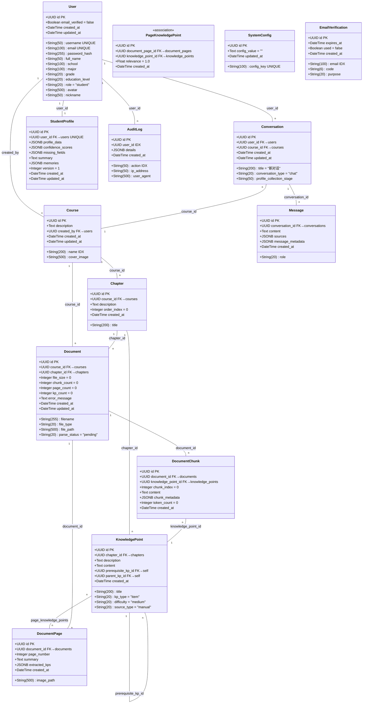

# MLA 多学助手 — 数据库结构文档

> 数据库: PostgreSQL | ORM: SQLAlchemy 2.0 异步 | 主键: UUID v4

---

## 〇、建表 SQL

```sql
-- ==========================================
-- MLA 多学助手 — 完整建表 DDL (PostgreSQL)
-- ==========================================

-- 启用 uuid-ossp 扩展 (UUID v4 生成)
CREATE EXTENSION IF NOT EXISTS "uuid-ossp";


-- ------------------------------------------
-- 1. users — 用户表
-- ------------------------------------------
CREATE TABLE users (
    id              UUID PRIMARY KEY DEFAULT uuid_generate_v4(),
    username        VARCHAR(50)  NOT NULL UNIQUE,
    email           VARCHAR(100) NOT NULL UNIQUE,
    password_hash   VARCHAR(255) NOT NULL,
    full_name       VARCHAR(50),
    school          VARCHAR(100),
    major           VARCHAR(100),
    grade           VARCHAR(20),
    education_level VARCHAR(20),
    role            VARCHAR(20)  NOT NULL DEFAULT 'student',
    avatar          VARCHAR(500),
    nickname        VARCHAR(50),
    email_verified  BOOLEAN      NOT NULL DEFAULT FALSE,
    created_at      TIMESTAMPTZ  NOT NULL DEFAULT NOW(),
    updated_at      TIMESTAMPTZ  NOT NULL DEFAULT NOW()
);
CREATE INDEX idx_users_username ON users (username);
CREATE INDEX idx_users_email    ON users (email);


-- ------------------------------------------
-- 2. courses — 课程表
-- ------------------------------------------
CREATE TABLE courses (
    id          UUID PRIMARY KEY DEFAULT uuid_generate_v4(),
    name        VARCHAR(200) NOT NULL,
    description TEXT,
    cover_image VARCHAR(500),
    created_by  UUID REFERENCES users(id) ON DELETE SET NULL,
    created_at  TIMESTAMPTZ  NOT NULL DEFAULT NOW(),
    updated_at  TIMESTAMPTZ  NOT NULL DEFAULT NOW()
);
CREATE INDEX idx_courses_name ON courses (name);


-- ------------------------------------------
-- 3. chapters — 章节表
-- ------------------------------------------
CREATE TABLE chapters (
    id          UUID PRIMARY KEY DEFAULT uuid_generate_v4(),
    course_id   UUID         NOT NULL REFERENCES courses(id) ON DELETE CASCADE,
    title       VARCHAR(200) NOT NULL,
    description TEXT,
    order_index INTEGER      NOT NULL DEFAULT 0,
    created_at  TIMESTAMPTZ  NOT NULL DEFAULT NOW()
);


-- ------------------------------------------
-- 4. knowledge_points — 知识点表
-- ------------------------------------------
CREATE TABLE knowledge_points (
    id                 UUID PRIMARY KEY DEFAULT uuid_generate_v4(),
    chapter_id         UUID         NOT NULL REFERENCES chapters(id) ON DELETE CASCADE,
    title              VARCHAR(200) NOT NULL,
    description        TEXT,
    content            TEXT,
    prerequisite_kp_id UUID REFERENCES knowledge_points(id) ON DELETE SET NULL,
    kp_type            VARCHAR(20)  NOT NULL DEFAULT 'item',
    parent_kp_id       UUID REFERENCES knowledge_points(id) ON DELETE SET NULL,
    difficulty         VARCHAR(20)  NOT NULL DEFAULT 'medium',
    source_type        VARCHAR(20)  NOT NULL DEFAULT 'manual',
    created_at         TIMESTAMPTZ  NOT NULL DEFAULT NOW()
);


-- ------------------------------------------
-- 5. documents — 文档表
-- ------------------------------------------
CREATE TABLE documents (
    id            UUID PRIMARY KEY DEFAULT uuid_generate_v4(),
    course_id     UUID         NOT NULL REFERENCES courses(id) ON DELETE CASCADE,
    chapter_id    UUID REFERENCES chapters(id) ON DELETE SET NULL,
    filename      VARCHAR(255) NOT NULL,
    file_type     VARCHAR(20)  NOT NULL,
    file_size     INTEGER      NOT NULL DEFAULT 0,
    file_path     VARCHAR(500) NOT NULL,
    parse_status  VARCHAR(20)  NOT NULL DEFAULT 'pending',
    chunk_count   INTEGER      NOT NULL DEFAULT 0,
    page_count    INTEGER      NOT NULL DEFAULT 0,
    kp_count      INTEGER      NOT NULL DEFAULT 0,
    error_message TEXT,
    created_at    TIMESTAMPTZ  NOT NULL DEFAULT NOW(),
    updated_at    TIMESTAMPTZ  NOT NULL DEFAULT NOW()
);


-- ------------------------------------------
-- 6. document_chunks — 文本切片表 (DOCX/MD/TXT)
-- ------------------------------------------
CREATE TABLE document_chunks (
    id                 UUID PRIMARY KEY DEFAULT uuid_generate_v4(),
    document_id        UUID    NOT NULL REFERENCES documents(id) ON DELETE CASCADE,
    knowledge_point_id UUID REFERENCES knowledge_points(id) ON DELETE SET NULL,
    chunk_index        INTEGER NOT NULL DEFAULT 0,
    content            TEXT    NOT NULL,
    chunk_metadata     JSONB   DEFAULT '{}'::jsonb,
    token_count        INTEGER NOT NULL DEFAULT 0,
    created_at         TIMESTAMPTZ NOT NULL DEFAULT NOW()
);


-- ------------------------------------------
-- 7. document_pages — 文档页面表 (PDF/PPTX)
-- ------------------------------------------
CREATE TABLE document_pages (
    id            UUID PRIMARY KEY DEFAULT uuid_generate_v4(),
    document_id   UUID         NOT NULL REFERENCES documents(id) ON DELETE CASCADE,
    page_number   INTEGER      NOT NULL,
    image_path    VARCHAR(500) NOT NULL,
    summary       TEXT,
    extracted_kps JSONB        DEFAULT '[]'::jsonb,
    created_at    TIMESTAMPTZ  NOT NULL DEFAULT NOW()
);


-- ------------------------------------------
-- 8. page_knowledge_points — 页面-知识点关联表
-- ------------------------------------------
CREATE TABLE page_knowledge_points (
    id                 UUID PRIMARY KEY DEFAULT uuid_generate_v4(),
    document_page_id   UUID    NOT NULL REFERENCES document_pages(id) ON DELETE CASCADE,
    knowledge_point_id UUID    NOT NULL REFERENCES knowledge_points(id) ON DELETE CASCADE,
    relevance          FLOAT   NOT NULL DEFAULT 1.0,
    created_at         TIMESTAMPTZ NOT NULL DEFAULT NOW(),
    CONSTRAINT uq_page_kp UNIQUE (document_page_id, knowledge_point_id)
);


-- ------------------------------------------
-- 9. conversations — 对话表
-- ------------------------------------------
CREATE TABLE conversations (
    id                      UUID PRIMARY KEY DEFAULT uuid_generate_v4(),
    user_id                 UUID        NOT NULL REFERENCES users(id) ON DELETE CASCADE,
    course_id               UUID REFERENCES courses(id) ON DELETE SET NULL,
    title                   VARCHAR(200) NOT NULL DEFAULT '新对话',
    conversation_type       VARCHAR(20)  NOT NULL DEFAULT 'chat',
    profile_collection_stage VARCHAR(50),
    created_at              TIMESTAMPTZ NOT NULL DEFAULT NOW(),
    updated_at              TIMESTAMPTZ NOT NULL DEFAULT NOW()
);


-- ------------------------------------------
-- 10. messages — 消息表
-- ------------------------------------------
CREATE TABLE messages (
    id              UUID PRIMARY KEY DEFAULT uuid_generate_v4(),
    conversation_id UUID        NOT NULL REFERENCES conversations(id) ON DELETE CASCADE,
    role            VARCHAR(20) NOT NULL,
    content         TEXT        NOT NULL,
    sources         JSONB,
    message_metadata JSONB,
    created_at      TIMESTAMPTZ NOT NULL DEFAULT NOW()
);


-- ------------------------------------------
-- 11. student_profiles — 学生画像表
-- ------------------------------------------
CREATE TABLE student_profiles (
    id                UUID PRIMARY KEY DEFAULT uuid_generate_v4(),
    user_id           UUID        NOT NULL UNIQUE REFERENCES users(id) ON DELETE CASCADE,
    profile_data      JSONB       NOT NULL DEFAULT '{}'::jsonb,
    confidence_scores JSONB       NOT NULL DEFAULT '{}'::jsonb,
    missing_fields    JSONB       NOT NULL DEFAULT '[]'::jsonb,
    summary           TEXT,
    memories          JSONB       NOT NULL DEFAULT '[]'::jsonb,
    version           INTEGER     NOT NULL DEFAULT 1,
    created_at        TIMESTAMPTZ NOT NULL DEFAULT NOW(),
    updated_at        TIMESTAMPTZ NOT NULL DEFAULT NOW()
);
CREATE INDEX idx_student_profiles_user_id ON student_profiles (user_id);


-- ------------------------------------------
-- 12. system_configs — 系统配置表
-- ------------------------------------------
CREATE TABLE system_configs (
    id           UUID PRIMARY KEY DEFAULT uuid_generate_v4(),
    config_key   VARCHAR(100) NOT NULL UNIQUE,
    config_value TEXT         NOT NULL DEFAULT '',
    updated_at   TIMESTAMPTZ  NOT NULL DEFAULT NOW()
);
CREATE INDEX idx_system_configs_key ON system_configs (config_key);


-- ------------------------------------------
-- 13. email_verifications — 邮箱验证码表
-- ------------------------------------------
CREATE TABLE email_verifications (
    id         UUID PRIMARY KEY DEFAULT uuid_generate_v4(),
    email      VARCHAR(100) NOT NULL,
    code       VARCHAR(6)   NOT NULL,
    purpose    VARCHAR(20)  NOT NULL,
    expires_at TIMESTAMPTZ  NOT NULL,
    used       BOOLEAN      NOT NULL DEFAULT FALSE,
    created_at TIMESTAMPTZ  NOT NULL DEFAULT NOW()
);
CREATE INDEX idx_email_verifications_email ON email_verifications (email);


-- ------------------------------------------
-- 14. audit_logs — 审计日志表
-- ------------------------------------------
CREATE TABLE audit_logs (
    id         UUID PRIMARY KEY DEFAULT uuid_generate_v4(),
    user_id    UUID,
    action     VARCHAR(50)  NOT NULL,
    ip_address VARCHAR(50),
    user_agent VARCHAR(500),
    details    JSONB        DEFAULT '{}'::jsonb,
    created_at TIMESTAMPTZ  NOT NULL DEFAULT NOW()
);
CREATE INDEX idx_audit_logs_user_id ON audit_logs (user_id);
CREATE INDEX idx_audit_logs_action  ON audit_logs (action);
```

---

## 一、总览 (UML 类图)



---

## 二、表结构详解

### 2.1 用户与认证

#### `users` — 用户表

| 字段 | 类型 | 约束 | 说明 |
|------|------|------|------|
| `id` | UUID | PK | 主键 |
| `username` | String(50) | UNIQUE, NOT NULL | 用户名 |
| `email` | String(100) | UNIQUE, NOT NULL | 邮箱 |
| `password_hash` | String(255) | NOT NULL | bcrypt 密码哈希 |
| `full_name` | String(50) | nullable | 真实姓名 |
| `school` | String(100) | nullable | 学校 |
| `major` | String(100) | nullable | 专业 |
| `grade` | String(20) | nullable | 年级 |
| `education_level` | String(20) | nullable | 学历 (undergraduate/master/doctoral) |
| `role` | String(20) | NOT NULL, default=`"student"` | 角色 (student/teacher/admin) |
| `avatar` | String(500) | nullable | 头像路径 |
| `nickname` | String(50) | nullable | 昵称 |
| `email_verified` | Boolean | NOT NULL, default=`false` | 邮箱是否已验证 |
| `created_at` | DateTime | NOT NULL | 创建时间 |
| `updated_at` | DateTime | NOT NULL | 更新时间 |

#### `email_verifications` — 邮箱验证码表

| 字段 | 类型 | 约束 | 说明 |
|------|------|------|------|
| `id` | UUID | PK | 主键 |
| `email` | String(100) | INDEX, NOT NULL | 目标邮箱 |
| `code` | String(6) | NOT NULL | 6 位验证码 |
| `purpose` | String(20) | NOT NULL | 用途 (register/reset_password) |
| `expires_at` | DateTime | NOT NULL | 过期时间 |
| `used` | Boolean | NOT NULL, default=`false` | 是否已使用 |
| `created_at` | DateTime | NOT NULL | 发送时间 |

---

### 2.2 课程与知识结构

#### `courses` — 课程表

| 字段 | 类型 | 约束 | 说明 |
|------|------|------|------|
| `id` | UUID | PK | 主键 |
| `name` | String(200) | INDEX, NOT NULL | 课程名称 |
| `description` | Text | nullable | 课程描述 |
| `cover_image` | String(500) | nullable | 封面图 URL |
| `created_by` | UUID | FK→users, SET NULL | 创建者 |
| `created_at` | DateTime | NOT NULL | 创建时间 |
| `updated_at` | DateTime | NOT NULL | 更新时间 |

**关系:** has many `chapters`, has many `documents` (cascade delete)

#### `chapters` — 章节表

| 字段 | 类型 | 约束 | 说明 |
|------|------|------|------|
| `id` | UUID | PK | 主键 |
| `course_id` | UUID | FK→courses, CASCADE | 所属课程 |
| `title` | String(200) | NOT NULL | 章节标题 |
| `description` | Text | nullable | 章节描述 |
| `order_index` | Integer | NOT NULL, default=`0` | 排序序号 |
| `created_at` | DateTime | NOT NULL | 创建时间 |

**关系:** belongs to `Course`, has many `KnowledgePoint` (cascade delete), has many `Document`

#### `knowledge_points` — 知识点表

| 字段 | 类型 | 约束 | 说明 |
|------|------|------|------|
| `id` | UUID | PK | 主键 |
| `chapter_id` | UUID | FK→chapters, CASCADE | 所属章节 |
| `title` | String(200) | NOT NULL | 知识点名称 |
| `description` | Text | nullable | 知识点描述 |
| `content` | Text | nullable | 正文内容 |
| `prerequisite_kp_id` | UUID | FK→self, SET NULL | 前置依赖知识点 |
| `kp_type` | String(20) | NOT NULL, default=`"item"` | 类型 (category=分类/item=知识点) |
| `parent_kp_id` | UUID | FK→self, SET NULL | 所属知识类型分类 |
| `difficulty` | String(20) | NOT NULL, default=`"medium"` | 难度 (easy/medium/hard) |
| `source_type` | String(20) | NOT NULL, default=`"manual"` | 来源 (manual/auto) |
| `created_at` | DateTime | NOT NULL | 创建时间 |

**关系:** belongs to `Chapter`, self-referencing `prerequisite_kp` 和 `parent_kp→children`, M2M with `DocumentPage` via `page_knowledge_points`

---

### 2.3 文档与页面

#### `documents` — 文档表

| 字段 | 类型 | 约束 | 说明 |
|------|------|------|------|
| `id` | UUID | PK | 主键 |
| `course_id` | UUID | FK→courses, CASCADE | 所属课程 |
| `chapter_id` | UUID | FK→chapters, SET NULL | 所属章节 (可选) |
| `filename` | String(255) | NOT NULL | 原始文件名 |
| `file_type` | String(20) | NOT NULL | 类型 (pdf/docx/pptx/md/txt) |
| `file_size` | Integer | NOT NULL, default=`0` | 文件大小 (字节) |
| `file_path` | String(500) | NOT NULL | 存储路径 |
| `parse_status` | String(20) | NOT NULL, default=`"pending"` | 状态 (pending/processing/done/failed) |
| `chunk_count` | Integer | NOT NULL, default=`0` | 切片数 (文本文件) |
| `page_count` | Integer | NOT NULL, default=`0` | 页面数 (PDF/PPTX) |
| `kp_count` | Integer | NOT NULL, default=`0` | 知识点数 |
| `error_message` | Text | nullable | 解析错误信息 |
| `created_at` | DateTime | NOT NULL | 创建时间 |
| `updated_at` | DateTime | NOT NULL | 更新时间 |

**关系:** belongs to `Course`, belongs to `Chapter` (可选), has many `DocumentChunk`, has many `DocumentPage`

#### `document_chunks` — 文本切片表

用于 DOCX/MD/TXT 文件的文本切片，作为旧版检索单元保留。

| 字段 | 类型 | 约束 | 说明 |
|------|------|------|------|
| `id` | UUID | PK | 主键 (同时也是 Chroma 向量键) |
| `document_id` | UUID | FK→documents, CASCADE | 所属文档 |
| `knowledge_point_id` | UUID | FK→knowledge_points, SET NULL | 关联知识点 |
| `chunk_index` | Integer | NOT NULL, default=`0` | 切片序号 |
| `content` | Text | NOT NULL | 文本内容 |
| `chunk_metadata` | JSONB | nullable | 元数据 (页码、章节等) |
| `token_count` | Integer | NOT NULL, default=`0` | Token 估算数 |
| `created_at` | DateTime | NOT NULL | 创建时间 |

#### `document_pages` — 文档页面表

用于 PDF/PPTX 文件的页面级知识点索引，替代 DocumentChunk 作为检索最小单元。

| 字段 | 类型 | 约束 | 说明 |
|------|------|------|------|
| `id` | UUID | PK | 主键 (同时也是 Chroma 向量键) |
| `document_id` | UUID | FK→documents, CASCADE | 所属文档 |
| `page_number` | Integer | NOT NULL | 页码 (从 1 开始) |
| `image_path` | String(500) | NOT NULL | 页面图片路径 |
| `summary` | Text | nullable | LLM 生成的页面摘要 |
| `extracted_kps` | JSONB | nullable | LLM 提取的知识点原始数据 |
| `created_at` | DateTime | NOT NULL | 创建时间 |

**关系:** belongs to `Document`, M2M with `KnowledgePoint` via `page_knowledge_points`

#### `page_knowledge_points` — 页面-知识点关联表

| 字段 | 类型 | 约束 | 说明 |
|------|------|------|------|
| `id` | UUID | PK | 主键 |
| `document_page_id` | UUID | FK→document_pages, CASCADE | 页面 ID |
| `knowledge_point_id` | UUID | FK→knowledge_points, CASCADE | 知识点 ID |
| `relevance` | Float | NOT NULL, default=`1.0` | 相关性权重 |
| `created_at` | DateTime | NOT NULL | 创建时间 |

**约束:** UNIQUE(`document_page_id`, `knowledge_point_id`)

---

### 2.4 对话系统

#### `conversations` — 对话表

| 字段 | 类型 | 约束 | 说明 |
|------|------|------|------|
| `id` | UUID | PK | 主键 |
| `user_id` | UUID | FK→users, CASCADE | 所属用户 |
| `course_id` | UUID | FK→courses, SET NULL | 关联课程 (限定 RAG 范围) |
| `title` | String(200) | NOT NULL, default=`"新对话"` | 对话标题 |
| `conversation_type` | String(20) | NOT NULL, default=`"chat"` | 类型 (chat/profile_collection) |
| `profile_collection_stage` | String(50) | nullable | 画像收集阶段 |
| `created_at` | DateTime | NOT NULL | 创建时间 |
| `updated_at` | DateTime | NOT NULL | 更新时间 |

**关系:** has many `Message` (cascade delete)

#### `messages` — 消息表

| 字段 | 类型 | 约束 | 说明 |
|------|------|------|------|
| `id` | UUID | PK | 主键 |
| `conversation_id` | UUID | FK→conversations, CASCADE | 所属对话 |
| `role` | String(20) | NOT NULL | 角色 (user/assistant/system) |
| `content` | Text | NOT NULL | 消息内容 (Markdown) |
| `sources` | JSONB | nullable | 引用来源列表 |
| `message_metadata` | JSONB | nullable | 元数据 (token数、模型、延迟等) |
| `created_at` | DateTime | NOT NULL | 创建时间 |

---

### 2.5 学生画像

#### `student_profiles` — 学生画像表

| 字段 | 类型 | 约束 | 说明 |
|------|------|------|------|
| `id` | UUID | PK | 主键 |
| `user_id` | UUID | FK→users, CASCADE, UNIQUE | 所属用户 (一人一份) |
| `profile_data` | JSONB | NOT NULL | 六维画像数据 |
| `confidence_scores` | JSONB | NOT NULL | 各维度置信度 |
| `missing_fields` | JSONB | NOT NULL | 待收集字段列表 |
| `summary` | Text | nullable | LLM 生成的画像摘要 |
| `memories` | JSONB | NOT NULL | 记忆片段 (最多30条) |
| `version` | Integer | NOT NULL, default=`1` | 画像版本号 |
| `created_at` | DateTime | NOT NULL | 创建时间 |
| `updated_at` | DateTime | NOT NULL | 更新时间 |

---

### 2.6 系统配置与日志

#### `system_configs` — 系统配置表

| 字段 | 类型 | 约束 | 说明 |
|------|------|------|------|
| `id` | UUID | PK | 主键 |
| `config_key` | String(100) | UNIQUE, INDEX, NOT NULL | 配置键名 |
| `config_value` | Text | NOT NULL, default=`""` | 配置值 |
| `updated_at` | DateTime | NOT NULL | 更新时间 |

**可配置项:** `llm_api_key`, `llm_api_base`, `llm_model`, `embedding_api_key`, `embedding_api_base`, `embedding_model`, `doc_parser_api_key`, `doc_parser_api_base`, `doc_parser_model`

#### `audit_logs` — 审计日志表

| 字段 | 类型 | 约束 | 说明 |
|------|------|------|------|
| `id` | UUID | PK | 主键 |
| `user_id` | UUID | INDEX | 操作者 |
| `action` | String(50) | INDEX, NOT NULL | 操作类型 |
| `ip_address` | String(50) | nullable | 客户端 IP |
| `user_agent` | String(500) | nullable | User-Agent |
| `details` | JSONB | nullable | 详细信息 |
| `created_at` | DateTime | NOT NULL | 操作时间 |

---

## 三、检索架构 (双轨制)

```
                   ┌──────────────────────────────────────┐
                   │           Chroma 向量数据库            │
                   │   按课程隔离: collection course_{id}   │
                   └──────────┬───────────────────────────┘
                              │
          ┌───────────────────┴───────────────────┐
          │                                       │
  metadata.type =                     metadata.type =
  "document_chunk"                    "document_page"
          │                                       │
          ▼                                       ▼
   ┌──────────────┐                        ┌──────────────┐
   │ DocumentChunk │                        │ DocumentPage │
   │   (文本文件)   │                        │  (PDF/PPTX)  │
   │  DOCX/MD/TXT │                        │ 页面图片+摘要  │
   └──────┬───────┘                        └──────┬───────┘
          │                                       │
          ▼                                       ▼
   文本切片检索结果                         页面图片卡片检索结果
   (纯文本展示)                             (缩略图+知识点标签)
```
